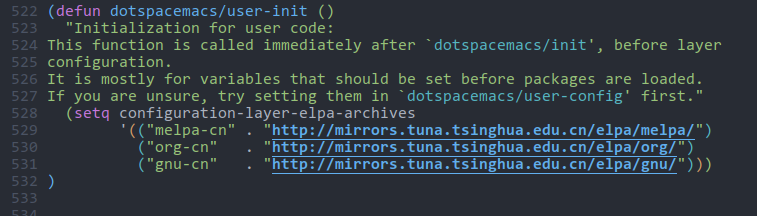

# Spacemacs 的安装

> 在开始之前，确保你的电脑上已经安装了 Emacs，如果是 Windows 系统的话，确保你已经添加了 HOME 环境变量
>
> 如果不知道 Windows 系统怎么添加 HOME 环境变量，可以[点击这里](添加环境变量.md)

## Windows 安装 Spacemacs

- 已安装 git

  如果你的电脑安装了 git 的话，打开 PowerShell，然后执行以下命令来安装 Spacemacs：

  ```shell
  git clone https://github.com/syl20bnr/spacemacs $home/.emacs.d
  ```

  因为要从 GitHub 下载，速度可能有点慢。如果速度太慢的话，可以执行下面这条命令：

  ```shell
  git clone https://codechina.csdn.net/mirrors/syl20bnr/spacemacs.git $home/.emacs.d
  ```

  Windows 系统默认并没有安装 git，如果你的电脑上没有安装 git 的话，你可以采用下面的方式来手动安装。

- 没有安装 git

  可以在 Spacemacs 的 [GitHub 仓库](https://github.com/syl20bnr/spacemacs#install-spacemacs-in-windows)下载 Spacemacs 的源码压缩包，如果速度太慢的话，可以在 Spacemacs 的[镜像源仓库](https://codechina.csdn.net/mirrors/syl20bnr/spacemacs)下载，下载完成后解压缩并将文件夹命名为`.emacs.d`，然后放置到主目录下即可。

> 完成以上步骤后先不要急着启动 Emacs！！！

## Linux 和 macOS 安装 Spacemacs

Linux 和 macOS 通常都默认安装了 git，打开终端，然后执行下面的命令来安装：

```shell
git clone https://github.com/syl20bnr/spacemacs ~/.emacs.d
```

如果速度太慢的话，可以用以下这条命令：

```shell
git clone https://codechina.csdn.net/mirrors/syl20bnr/spacemacs.git ~/.emacs.d
```

> 完成以上步骤后先不要急着启动 Emacs！！！

---

安装完 Spacemacs 之后，下次启动 Emacs 就会自动从 Melpa 下载包了，但是 Melpa 的服务器在国外，因为包下载的速度会特别慢，要等很久，可以用更改镜像源的方法解决，我们这里使用清华的镜像源。

启动 Emacs 时，它会问你想要使用那种编辑模式（Vim或Emacs），根据自己的喜好选择好之后回车即可，然后会询问你是想安装标准版的 Spacemacs 还是精简版的 Spacemacs  `minimal`，同样自己选择之后回车即可。此时应该会开始下载包了，并且会在主目录下生成一个`.spacemacs`文件。这时通过任务管理器或系统监视器关闭 Emacs，然后在`.spacemacs`中找到`dotspacemacs/user-init()`，然后在里面添加下面的代码：

```lisp
(setq configuration-layer-elpa-archives
    '(("melpa-cn" . "http://mirrors.tuna.tsinghua.edu.cn/elpa/melpa/")
      ("org-cn"   . "http://mirrors.tuna.tsinghua.edu.cn/elpa/org/")
      ("gnu-cn"   . "http://mirrors.tuna.tsinghua.edu.cn/elpa/gnu/")))

```

添加完成后应该如下图所示：



此时再启动 Emacs 就会从清华源开始下载包，速度应该会快很多，然后耐心等待它下载完就可以了。
