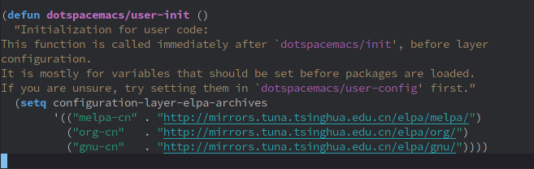

# Day01 - Spacemacs 的安装

在开始之前，确保你的电脑上已经安装了 Emacs，如果是 Windows 系统的话，确保你已经添加了 HOME 环境变量
如果不知道 Windows 系统怎么添加 HOME 环境变量，可以[查看](emacs_wrong.md) Emacs 疑难杂症板块

本文介绍如何安装 Spacemacs

> Spacemacs 是一套 Emacs 配置文件，准确来说，应该是安装 Spacemacs 这套配置

## Windows 安装 Spacemacs

- 通过 git 安装

如果你的电脑安装了 git 的话，打开 PowerShell，然后执行下面这条命令来安装 Spacemacs：

  ```shell
git clone https://github.com/syl20bnr/spacemacs $home/.emacs.d
  ```

  因为要从 GitHub 下载，速度可能有点慢。如果速度太慢的话，可以从 CodeChina 的镜像进行安装：

  ```shell
git clone https://codechina.csdn.net/mirrors/syl20bnr/spacemacs/-/tree/develop.git $home/.emacs.d
  ```

  Windows 系统默认并没有安装 git,你可以采用下面的方式来手动安装。

- 手动安装

  可以在 Spacemacs 的 [GitHub 仓库](https://github.com/syl20bnr/spacemacs#install-spacemacs-in-windows)下载 Spacemacs 的源码压缩包，如果速度太慢的话，可以在 Spacemacs 的[镜像源仓库](https://codechina.csdn.net/mirrors/syl20bnr/spacemacs)下载，下载完成后解压缩并将文件夹命名为`.emacs.d`，然后放置到主目录下即可。

## Linux 和 macOS 安装 Spacemacs

Linux 和 macOS 通常都默认安装了 git，打开终端，然后执行下面这条命令来安装：

```shell
git clone https://github.com/syl20bnr/spacemacs ~/.emacs.d
```

如果速度太慢的话，可以从 CodeChina 的镜像进行安装：

```shell
git clone https://codechina.csdn.net/mirrors/syl20bnr/spacemacs/-/tree/develop.git ~/.emacs.d
```

## 第一次启动 Spacemacs

安装完 Spacemacs 之后，启动 Emacs 就会自动从 Melpa 下载包(packages)了，但是 Melpa 的服务器在国外，所以包下载的速度会特别慢。我们可以更改镜像源解决这个问题，我们这里使用清华的镜像源为例。

启动 Emacs 时，它会问你想要使用那种编辑模式 vim(默认)或是 emacs，根据自己的喜好选择好之后回车即可，接着会询问你是想安装标准版的 Spacemacs(默认) 还是精简版的 Spacemacs-base，同样自己选择之后回车即可。

此时应该会开始下载包了，并且会在主目录下生成一个 `.spacemacs` 文件。通过任务管理器或系统监视器关闭 Emacs，然后在`.spacemacs`中找到 `dotspacemacs/user-init()`（可以按 <kbd>C-s</kbd> 进行文本搜索），在这个函数里面添加如下的代码：

```lisp
(setq configuration-layer-elpa-archives
    '(("melpa-cn" . "http://mirrors.tuna.tsinghua.edu.cn/elpa/melpa/")
      ("org-cn"   . "http://mirrors.tuna.tsinghua.edu.cn/elpa/org/")
      ("gnu-cn"   . "http://mirrors.tuna.tsinghua.edu.cn/elpa/gnu/")))
```

添加完成后应该如下图所示：



此时再启动 Emacs 就会从清华源开始下载包，速度应该会快很多，然后耐心等待它下载完就可以了。全部下载完之后，重启一下 Emacs，就可以看到 Spacemacs 的图标了。

如果你选择的不是 Emacs 的编辑模式，那么在安装完所有包后可能会有一条关于 `evil-want-keybinding` 的警告，你需要在 .spacemacs 中的 `dotspacemacs/user-init` 添加：

```lisp
(setq evil-want-keybinding nil)
```
