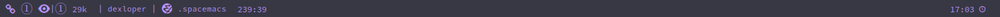

# Spacemacs 的进阶配置
本节将会详细讲解 .spacemacs 文件中的大部分配置，读者可以根据自己的需要自行修改

## .spacemacs 基本介绍
.spacemacs 一般会自动生成在主目录下，这个文件是配置 Spacemacs 的入口，有关于 Spacemacs 本身的配置基本都能在里面进行修改，用户设置同样在这个文件中修改。

.spacemacs 中，内容一般被分为以下几个部分，每个部分都封装在一个函数中：

- `dotspacemacs/layers`

在这里可以声明一些 layer，以及删除、增添一些包，在这里还可以调整 Spacemacs 加载时的一些行为

- `dotspacemacs/init`

Spacemacs 绝大部分的配置都位于此，你可以在此修改配置中可选的选项，但绝对不能将自己的用户配置代码添加在这里

- `dotspacemacs/user-init`

一般在这里设置你需要使用的 elpa 源

- `dotspacemacs/user-config`

在这里可以添加你的用户配置代码，你自己的定义的大部分配置一般都在这里完成

- `dotspacemacs/emacs-custom-settings`

Spacemacs 自己生成的配置，同样不建议自己去修改

## 开始配置
接下来开始讲解，可配置的选项按出现的位置进行排序（从上到下）

### `dotspacemacs/layers`

该部分主要是关于 Spacemacs 中 layer 的声明和配置，和 Spacemacs 安装软件包的行为的配置

- `dotspacemacs-distribution`

可选的值有 spacemacs-base 和 spacemacs，spacemacs-base 可以理解为是一个精简版
的 Spacemacs，默认为 spacemacs ，即一个完整的 Spacemacs

- `dotspacemacs-enable-lazy-installation`

> 惰性安装：
> 本配置的主要功能是当你打开一个文件时，spacemacs 会自动根据文件的类型安装相应的 layer,就比如打开一个 java 源代码文件，spacemacs 便会询问你是否需要安装对应的 layer，类似于 vscode，当你打开一个文件时，将会询问你是否需要安装相应的扩展

该选项可选的值有 all、unused 和 nil，all 将会惰性安装所有支持惰性安装的 layer，unused 只会安装你没有使用的 layer，nil 将禁用惰性安装这一功能，默认为 unused

- `dotspacemacs-ask-for-lazy-installation`

对应于上面的选项，在安装相应的 layer 前会询问你是否需要安装，可选的值有 t 和 nil，默认为 t

- `dotspacemacs-configuration-layer-path`

如果你配置了自己的 layer，但是却把它放在了 .emacs.d 以外的文件夹中，为了让 spacemacs 可以找到这个 layer，就需要配置这个选项。Spacemacs 将会额外从这个目录中寻找 layer。值为一个目录的路径，结尾要带上“/”

- `dotspacemacs-configuration-layers`

声明 layer 的地方，在此声明过的 layer 将会在下次启动 Spacemacs 时自动安装，也可以进行一些 layer 的配置，如：

```lisp
dotspacemacs-configuration-layers
       '(html
         python
         auto-completion
         better-defaults
         emacs-lisp
         (lsp      :variables lsp-headerline-breadcrumb-enable nil)
         markdown
         org
         syntax-checking
         (treemacs :variables treemacs-use-all-the-icons-theme t)
         (ivy      :variables ivy-enable-icons t)
         (eaf      :variables eaf-browser-dark-mode nil
                   eaf-browser-default-search-engine "bing"
                   eaf-browser-enable-adblocker t
                   eaf-browse-blank-page-url "https://cn.bing.com"
                   browse-url-browser-function 'eaf-open-browser)
         )
```

- `dotspacemacs-additional-packages`

添加单独的包的地方将包名填入括号中后，下次启动 Spacemacs 时就会自动开始安装，也可以在此进行一些简单的包配置。**不在此选项中出现的包将会在下次启动 Spacemacs 被删除，因此不建议使用 package-install 安装包**

- `dotspacemacs-frozen-packages`

将包名添加到这个选项中后，该包将会禁止更新

- `dotspacemacs-excluded-packages`

主要用于移除一些 layer 中你不想要的包，填写在这里这里的包将会被移除

- `dotspacemacs-install-packages`

定义了 Spacemacs 安装包的一般行为，可选的值有 used-only、used-but-keep-unused 和 all

> 关于包的定义：

> 你使用的包：你声明过的 layer 中包含的包和在 dotspacemacs-additional-packages 中添加的包。

> 你没有使用的包：没有填写在 dotspacemacs-additional-packages 中的包，这些包将会被删除。

used-only 会安装你*使用的包*，而删除那些*你没有使用的包*，used-but-keep-unused 会安装*你使用的包*，但不会删除*你没有使用的包*，all 会安装 Spacemacs 支持的**所有包**

### `dotspacemacs/init`

这里包含了 Spacemacs 中绝大部分的可配置选项，你不应该把你自己的配置代码添加在这里，并且这个部分的内容会在 Spacemacs 启动的最开始生效。注：有部分不影响使用的配置没有讲到（其实是因为不知道）

- `dotspacemacs-elpa-https`

在访问 elpa 存储库时使用 https 域名，可选的值有 nil 和 t，默认为 t，建议为 t

- `dotspacemacs-elpa-timeout`

设置访问 elpa 的超时时间，单位为秒，默认值为5

- `dotspacemacs-use-spacelpa`

可选的值有 t 和 nil，如果是 t，将默认从 Spacelpa 安装稳定的包，如果是 nil，将默认从 Melpa 安装最新的包，默认为 nil

- `dotspacemacs-verify-spacelpa-archives`

可选的值有 t 和 nil，如果是 t 并且如果你开启了从 Spacelpa 安装包，则会验证下载的包的签名，默认为 t

- `dotspacemacs-check-for-update`

可选的值有 t 和 nil，如果是t，并且你使用的 Spacemacs 不是 develop 分值的话，将会在启动时检查更新。默认为 nil

>注意，我们默认安装的 Spacemacs 就是 develop 分支，develop 不能通过这个来更新 Spacemacs 版本，我们也没有必要频繁的更新 Spacemacs。同时，我也并不推荐使用 master 分支的 Spacemacs，因为 master 分支的 Spacemacs 和文档距离上次更新都已经将近五年了。。。

- `dotspacemacs-editing-style`

设置 Spacemacs 的编辑风格，可选的值有 vim、emacs 和 hybrid，hybrid 更像是 vim 和 emacs 的结合体，它将 vim 的插入模式改为了 emacs 的编辑模式，你同样可以通过 `:variables` 来修改一些默认的选项

- `dotspacemacs-startup-buffer-show-version`

在启动时是否显示 Spacemacs 和 Emacs 的版本，可选的值有 t 和 nil，默认为 t

- `dotspacemacs-startup-banner`

设置 Spacemacs 启动时显示的 Logo，可选的值有 official、random、nil 和你自己图像的路径，这个路径必须是一个字符串。默认为 offical，如果是 nil，则不显示 Logo

- `dotspacemacs-statup-lists`

设置 Spacemacs 启动时显示的列表，值有 recents、recent-by-project、bookmarks、projects、agenda、todos，可以显示最近打开的文件、项目、书签和 todo 等，接受一个列表，项后面的数字是该项目显示的长度，修改为 nil 可以不显示

- `dotspacemacs-startup-buffer-responsive`

可选的值有 t 和 nil, 如果是 t 的话, 那么你就可以调整 buffer 的大小, 默认为 t

- `dotspacemacs-show-start-list-numbers`

在开始界面的列表的项前面显示数字（如果你开启了显示列表的话）, 这样的话, 直接按数字就可以打开对应的文件、项目等, 可选的值有 t 和 nil, 默认为 t

- `dotspacemacs-startup-buffer-nulti-digit-delay`

按下数字键后的最小延迟时间（即等待时间）, 单位为秒, 默认为 0.4

- `dotspacemacs-new-empty-buffer-major-mode`

打开一个新的缓冲区后默认的模式, 可选的值有 text-mode 和 nil, 如果设置成 nil, 则使用基本模式, 默认为 text-mode

- `dotspacemacs-scratch-mode`

用来设置 scratch 这个 buffer 默认的模式, 可选的值有 text-mode 和 nil, 默认为 text-mode

- `dotspacemacs-scratch-buffer-persistent`

可选的值有 t 和 nil, 如果是 t, 你在 scratch 缓冲区写下的所有内容都会被自动保存, 默认为 nil

- `dotspacemacs-scratch-buffer-unkillable`

可选的值有 t 和 nil, 如果是 t, `kill-buffer`不会 kill 掉 scratch 缓冲区, 而是 bury（机翻是埋葬？我不好怎么翻译） 它, 默认为 nil

- `dotspacemacs-initial-scratch-message`

用来自定义 scratch 缓冲区上显示的内容, 可选的值有 nil 和一个字符串, 就比如: "Welcome to Spacemacs!"

默认为 nil

- `dotspacemacs-themes`

用来设置 Spacemacs 的主题, Spacemacs 默认使用该列表中的第一个主题, 可以按`SPC T n`来切换这个列表中的主题

> 如果使用的是 Emacs 的编辑模式, SPC(leader 键)应该是`M-m`！

- `dotspacemacs-mode-line-theme`

用来设置 Spacemacs 中 mode-line 的主题, 就是 Spacemacs 下面的那根长条, 可选的主题有

1. spacemacs
2. all-the-icons
3. custom
4. doom
5. vanilla

custom 是用来自定义的主题, vanilla 是原生 Emacs 默认的主题, 显示效果如下
> 显示效果会受主题和字体的影响！！！

spacemacs:


all-the-icons:


doom:


vanilla:


关于 custom 主题的自定义和 mode-line 的一些值的配置, 这里就不过多赘述了, 想要了解的话,可以参见[官方文档](https://develop.spacemacs.org/doc/DOCUMENTATION.html#mode-line)

- `dosspacemacs-colorize-cursor-according-to-state`

可选的值有 t 和 nil, 如果是 t 的话, 光标的颜色会和 Spacemacs 中的状态的颜色一致, Spacemacs 中常用的状态一般有

- Emacs 蓝色
- Vim 正常模式 橙色
- Vim 插入模式 绿色

默认值为 t

- `dotspacemacs-default-font`

用来设置 Spacemacs 的字体, `:size`可以用来调整字体的大小, 如果值是一位小数的话, 则根据字号来调整字体的大小, 如果是整数的话, 则根据像素多少来调整字体的大小, 默认为 10.0, 如果你想用整数的话, 一般 14 是标准的大小, 依据你使用的字体而定。

`:weight`用来调整字体的字重, `:width`用来调整字体的宽度, `:weight`用来调整字体的高度

- `dotspacemacs-leader-key`

用来设置 leader 键, 一般用于 Vim 和 Hybrid 编辑模式, leader 键主要用来自定义自己的快捷键。默认为 "SPC"

- `dotspacemacs-emacs-command-key`

用于在 Vim 和 Hybrid 编辑模式中, 按下 leader 键后, 用来代替 Emacs 中`M-x`的键, 默认为"SPC"

- `dotspacemacs-ex-command-key`

用来设置 Vim 编辑模式下 Ex 命令使用的键, 默认为 ":"

- `dospacemacs-emacs-leader-key`

用来设置 Emacs 的编辑模式和 Vim 的插入模式下的 leader 键, 默认为 "M-m"

- `dosspacemacs-major-mode-leader-key`

用来设置一个快捷键, 相当于按下`<leader 键> m`, 如`M-m m`, 可以用来方便一些操作, 默认为 ","

- `dotspacemacs-`
