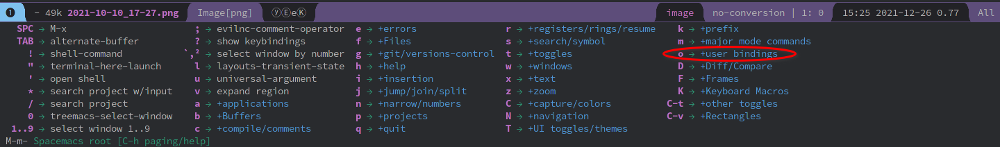

# Day07 - 善用 leader 键和一些建议的配置

## 用 leader 键定义自己的快捷键

在 Spacemacs 中按下 leader 键后，等待一会应该会出现如下图的界面，其中包括`user bindings`，这是专门用来给用户定义快捷键的区域。如果你想要方便的执行一些函数，而这些函数又是 Spacemacs 本身不带有的或者不符合你口味的，你可以试试用这个来定义你自己的快捷键。



下面举两个例子

### 定义一个重启 Emacs 的快捷键

在 .spacemacs 文件中修改一些配置后，通常需要重启 Spacemacs 才会生效，但按 <kbd>C-x C-c</kbd> 退出 Spacemacs 再打开实在麻烦。`restart-emacs`可以快速重启 Emacs，且 Spacemacs 中已经定义好了相关的快捷键 <kbd>M-m q R</kbd> ，但是可能不太好按。现在上文的 <kbd> M-m o</kbd> 可以派上用场了，Emacs 中一般可以用下面的方式来绑定一个命令到一个键

```lisp
(global-set-key (kbd "<key>") '<function>)
```

其中 <key> 是你要绑定的键，<function> 是你希望执行的命令（函数），我希望把`restart-emacs`绑定到 <kbd>M-m o r</kbd> 中去，那么我可以

```lisp
(global-set-key (kbd "M-m o r") 'restart-emacs)
```

然后就可以用 <kbd>M-m o r</kbd> 来重启 Spacemacs 了。同时，之前的快捷键也并没有失效

### 绑定一个键到 helm-swoop

如果添加了 ivy 这个 layer，那么你现在随意在某个文件按下 <kbd>C-s</kbd> 就可以进行更好的全文搜索，helm 中的`helm-swoop`同样可以实现这个功能，你可以按`M-x helm-swoop`，但是更好的方法是将它绑定一个键。ivy 可以直接按 <kbd>C-s</kbd> 进行全文搜索是因为 layer 中已经添加了键绑定相关的配置，我们可以手动为`helm-swoop`绑定一个键，方法同上

```lisp
(global-set-key (kbd "C-s") 'helm-swoop)
```

现在可以使用 <kbd>C-s</kbd> 调用`helm-swoop`进行全文搜索了

事实上，leader 键的内容远远不止这些，这还只是冰山一角，我不可能讲得面面俱到，否则这个教程也没有存在的意义。更多的内容，还需要你自己去探索


