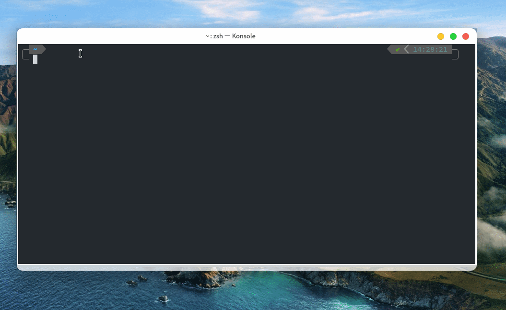

# Day08 - Emacs Server

## Emacs Server 是什么？

Emacs Server 可以在你的内存中建立一个类似于服务器的东西（把你的配置加载到内存中），这样的你要是想使用 Emacs 就可以直接开启一个 Emacs 客户端来连接到这个服务器，而不需要打开 Emacs 后再加载一边配置，可以极大的提高 Emacs 的启动速度，通常情况下**一秒不到**便可启动！

## 使用教程

在终端中运行

```shell
emacs --daemon
```

接着便会开始加载配置，加载完成后，使用`emacsclient`命令可以直接连接到刚才加载的配置，但后面通常用带上文件名，如: `emacsclient test.sh`。使用`emacsclient -c`可以直接以图形化界面运行 Spacemacs。演示如下:



下面这条命令可以让系统在开机时自动建立起一个 Emacs Server，这样的话就不必每次都执行`emacs --daemon`这条命令，可以直接使用`emacsclient`

```shell
systemctl --user enable emacs
```

你还可以直接将 emacsclient 设置为终端的默认编辑器

```shell
export EDITOR='emacsclient -c'
```

.spacemacs 文件中同样有相关的配置，如果你使用的系统无法使用上面的命令来自动启动 Emacs Server，可以在 .spacemacs 修改下面的配置，这会在 Spacemacs 启动时自动开启一个 Emacs Server

```lisp
(setq-default dotspacemacs-enable-server t)
```

如果想要关闭已经开启的服务器，可以从 emacsclient 启动 Spacemacs，然后执行`SPC q q`来退出 Emacs 并关闭掉服务器

## 目前已知的问题

1. 正常情况下修改 .spacemacs 文件中的配置后，在 emacsclient 中并不会生效，而是要重新加载配置之后配置才会生效。严格来说这并不算是问题
2. 一些关于字体的配置在 emacsclient 中无效，如单独设置中英文字体的配置
3. Linux 下 emacsclient 无法使用 Fcitx 输入法，可以使用 pyim 或者 emacs-rime 解决
4. 有关 Spacemacs 全屏启动的设置并不会在启动 emacsclient 时生效